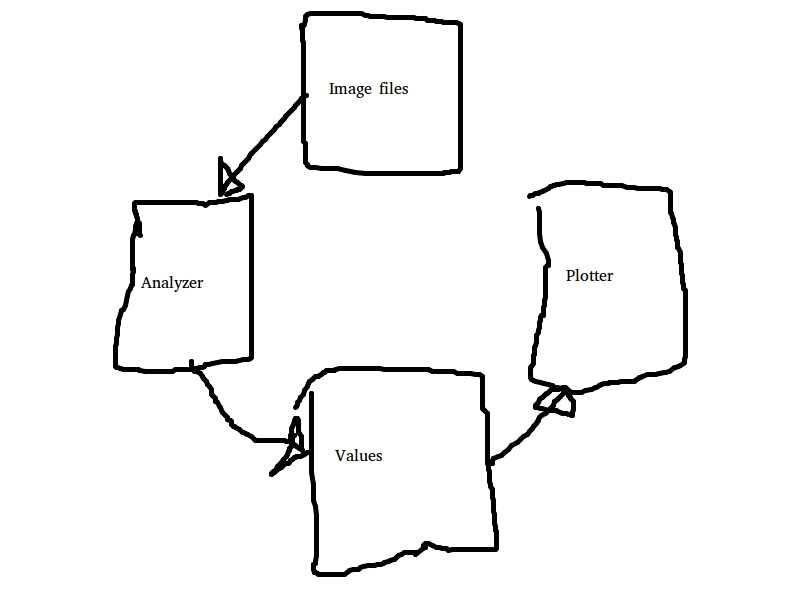

# XBuildTrimble
Challenge provided by Trimble, at the Xbuild.

# Architecture

Something that feels like that?

# LOGS
# Somewhere around 11:25 AM
Currently, the image files (the data they are providing) is being uploaded to the Devpost (and a copy of it is being sent directly to my e-mail).
I should go set up the environment.
